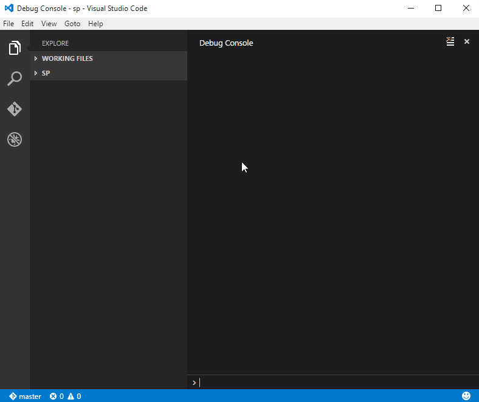
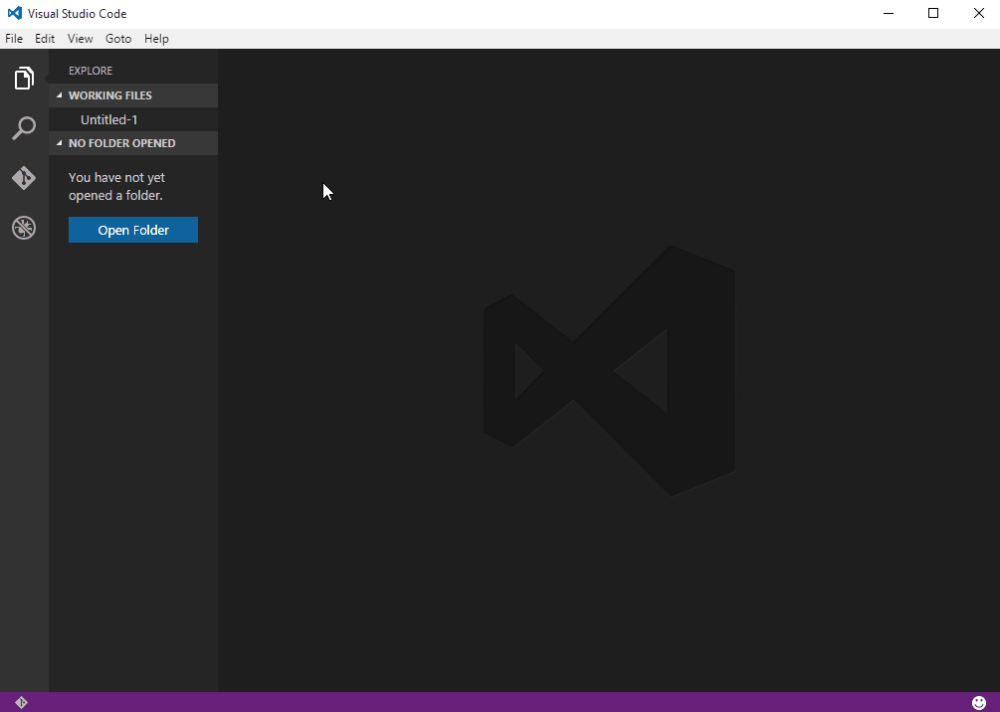

# SPTools
The purpose of this extension is to help **developers** (especially front end) to work on remote **SharePoint** sites using **Visual Studio Code**.

## Install

`ext install SPTools`



## Extension settings

These are your extension settings (refer to the description property for more details):

```json
"sptools.workFolder": {
	"type": "string",
	"default": "$home",
	"description": "Path to your top level work folder. Default to home/sptools (cross platform)."
},
"sptools.spFolders": {
	"type": "array",
	"default": [
		"/_catalogs/masterpage/sptools",
		"/style library/en-us/themable/sptools"
	],
	"description": "Folders to be fetched from SharePoint sites. Use server relative paths."
},
"sptools.storeCredentials": {
	"type": "boolean",
	"default": true,
	"description": "Set to false if you don't want credentials to be cached."
},
"sptools.checkInComment": {
	"type": "string",
	"default": "From SPTools for VS Code",
	"description": "Your check in comment."
}
```

To override them, specify your own values in `File > Preferences` then either `User Settings` or `Workspace Settings`.



It's a good idea to set your own SharePoint folders list, the default ones will probably not exist on your sites.

### Default project folder (sptools.workFolder)

By default, the local work folder will be `home/sptools`
:
- `C:\Users\username\sptools` on *Windows*
- `/Users/username/sptools` on *OSX*

### Folders creation

Please keep in mind that any non existing folder used in the config will be created, specifically the working folder `sptools.workFolder`.

## spconfig.json

This is a **workspace specific** config file, created automatically at the root of the workspace when using the `SPTools: Init` command.

For now it only stores the SharePoint site URL and you don't need to touch it.

## Commands

Most of the commands below run their own checks and suggest any recommended actions.

Example: You want to upload, file is not checked out. Suggests to check out then upload.

### SPTools: New workspace

Create a new *SharePoint* workspace from a remote site.

Replicate folder structure and download all files locally.

SharePoint workspaces (folders with a top level spconfig.json file) will prompt you to login to the relevant remote site the first time you open a file. This is because the extension is checking the current file status (date and check out status) when opening it (there is a small latence so it won't check dozen of files if you quickly switch between them).

### SPTools: Check file state

**Compare** remote and local last modified dates, get check out state and update statusbar indicators accordingly.

### SPTools: Sync file

**Download** remote file, replace current local file.

### SPTools: Upload file

**Upload** current file to remote site, replace remote file with local one.

### SPTools: Check in/out/discard file

Check file status and ask if you want to **check it in, out or discard** the current check out depending on the current state.

### SPTools: Sync entire workspace

Sync entire workspace (Not implemented yet)

### SPTools: Reset credentials cache

**Delete** all cached credentials

## A word about credentials

Credentials are not stored in files, but rather kept in the extension memory.

Use `SPTools: Reset credentials cache` command to reset the cache.

## Compatibility

- Windows
- OSX
- *nix (need feedback)

- SharePoint 2013 *online*
- SharePoint 2013 *on premise* (NTLM/basic)

(SPTools works best with GIT)

## Known issues

- `Sync entire workspace` command not implemented yet
- In some cases time zone difference between SharePoint site and VS Code client can result in wrong "up to date" notice
- Image files are not downloaded correctly
- Users with same Display Name **AND** no email address in SharePoint will be resolved as same (e.g. files will be resolved as "checked out to you" for both)

## What to expect next

- SharePoint 2010 compatibility (on prem)
- Ignore specific files option using paterns
- Use WinCred or environment specific credentials storage
- Auto checkin/out files option
- SharePoint specific snippets
- Update/remove specific credentials

** Enjoy!**